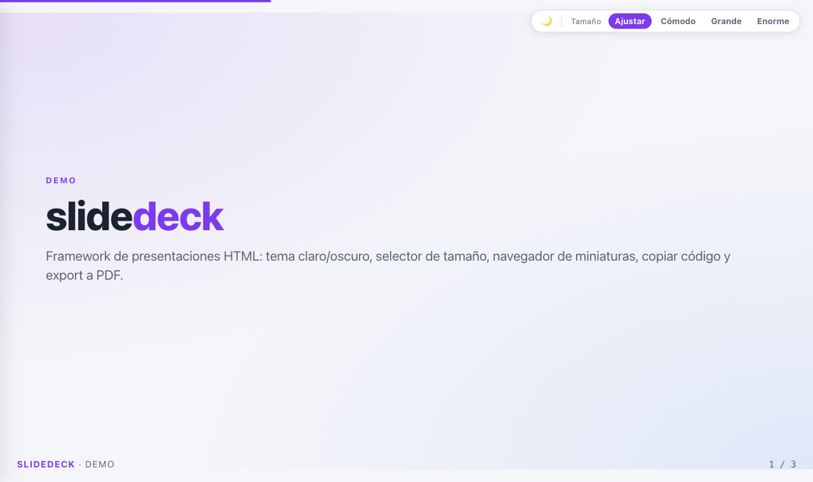
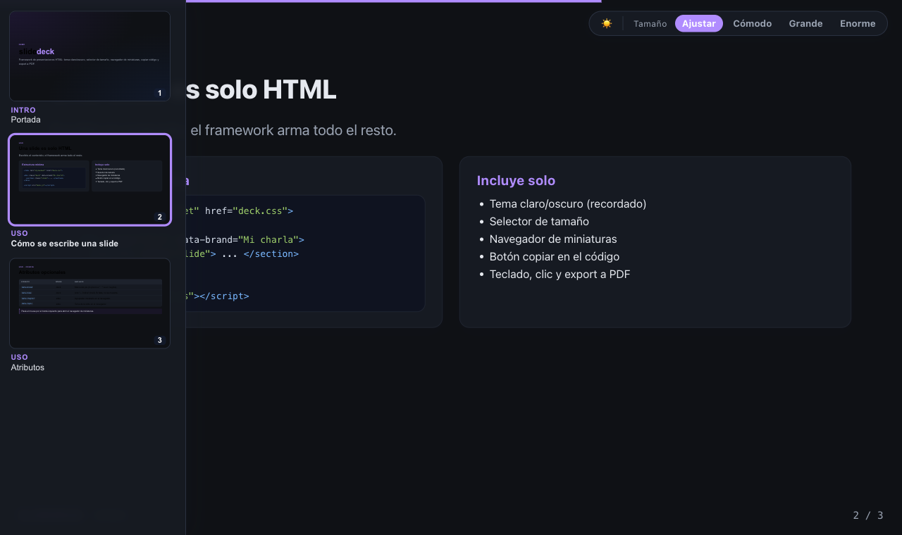

# slidedeck

Framework liviano y **libre** para presentaciones en HTML — un solo `deck.css` + `deck.js`, sin build.

Escribís las slides como HTML plano y el framework aporta el resto: tema claro/oscuro (recordado), selector de tamaño, navegador de miniaturas (capítulo · tema), botón de copiar en los bloques de código, navegación por teclado/clic/hash y exportación a PDF.





**Demo en vivo:** https://spktro.github.io/slidedeck/demo.html

## Uso

```html
<!DOCTYPE html>
<html lang="es">
<head>
  <meta charset="UTF-8" />
  <meta name="viewport" content="width=device-width, initial-scale=1.0" />
  <title>Mi presentación</title>
  <link rel="stylesheet" href="https://cdn.jsdelivr.net/gh/Spktro/slidedeck@v1/deck.css" />
</head>
<body>
  <div class="deck" id="deck" data-brand="Mi charla" data-home="../index.html">
    <section class="slide title-slide active" data-chapter="Intro" data-topic="Portada">
      <h1 class="title">Hola <span class="accent">mundo</span></h1>
      <p class="subtitle">Subtítulo</p>
    </section>
    <section class="slide" data-chapter="Tema" data-topic="Detalle">
      <h2 class="slide-title">Una slide</h2>
      <ul class="bullets"><li>Punto uno</li><li>Punto dos</li></ul>
    </section>
  </div>
  <script src="https://cdn.jsdelivr.net/gh/Spktro/slidedeck@v1/deck.js"></script>
</body>
</html>
```

La primera slide debe llevar la clase `active`.

## Config

| Atributo | Dónde | Qué hace |
|----------|-------|----------|
| `data-brand` | `.deck` | Marca del pie. Lo anterior al primer `· ` se muestra en negrita. |
| `data-home`  | `.deck` | href del botón "← Índice". Si se omite, no aparece. |
| `data-repo`  | `.deck` | URL del repositorio: muestra un ícono de GitHub junto a la marca. |
| `data-click-nav` | `.deck` | `off` desactiva la navegación por clic en mitades (teclado, hash y miniaturas siguen andando). |
| `data-chapter` | `.slide` | Agrupador mostrado en el navegador de miniaturas. |
| `data-topic` | `.slide` | Tema de la slide en el navegador. |

## Clases útiles para el contenido

`title-slide`, `slide-eyebrow`, `h1.title` (+ `.accent`), `h2.slide-title`, `subtitle`,
`columns` (`.three` / `.four`), `card` (+ `h3`), `imgcard` + `imgcaption`,
`pre.code` (con spans `.k` keyword, `.t` tipo, `.s` string, `.n` número, `.c` comentario),
`table.tbl`, `callout`, `small-note`, `pill`, `ul.bullets`, `ol.steps`, `flow` + `arrow`, `kbd`.

## Atajos

`→` / `Espacio` siguiente · `←` atrás · `Inicio` / `Fin` · clic en el fondo de la slide, mitad izq/der · `#N` en la URL.
El clic solo navega si cae en el fondo, no sobre texto: seleccionar (arrastre, doble o triple clic) no cambia de slide.
Export a PDF: `Ctrl/Cmd + P`.

## Versionado

Los cambios por versión están en [CHANGELOG.md](CHANGELOG.md).

Fijá una versión en la URL del CDN (`@v1`, `@v1.0.0`, o un commit) para estabilidad.
Ver `demo.html` para un ejemplo completo.
